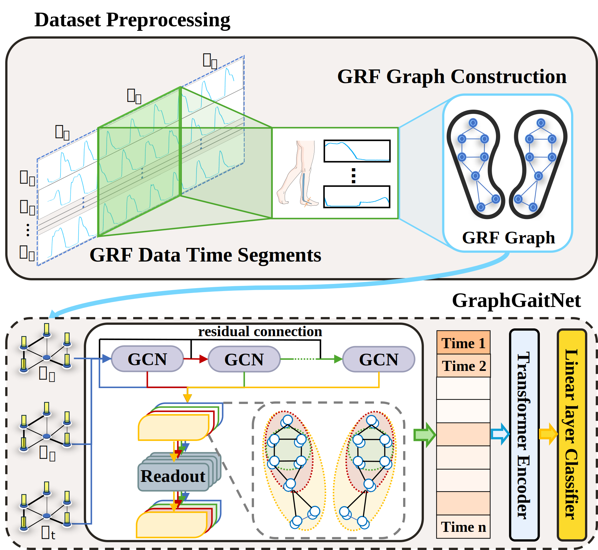

# GraphGaitNet

## Environment
- python == 3.9
- pytorch == 2.2.0
- torch_geometric == 2.5.3
- scikit-learn == 1.3.0
- pandas == 2.2.2
- numpy == 1.26.4

## Dataset
> Gait in Parkinson's Disease: https://www.physionet.org/content/gaitpdb/1.0.0/